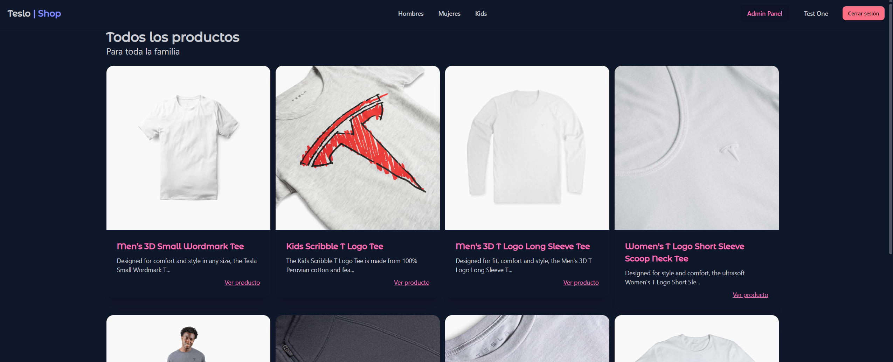
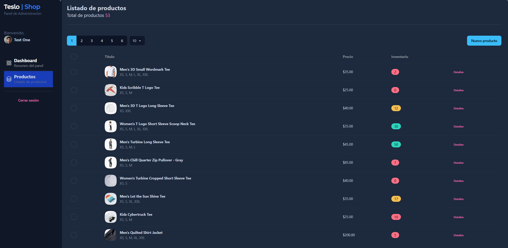
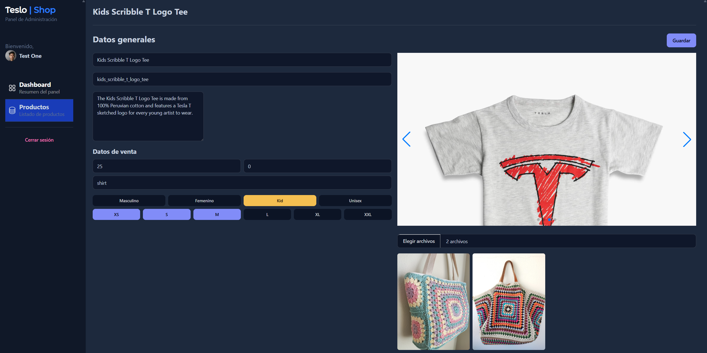

<div align="center">
  <br />
  <h1>🛒 Teslo Shop</h1>
  <h3 align="center">Ecommerce & Admin dashboard | Devtalles course</h3>
  
  <br />

  <h3>Admin panel page:</h3>
  
  <h3>Product creation:</h3>
  
  <br />

  <div>
     
    
    
    
  </div>

   <div align="center">
     <h3>Angular course - 09 Teslo-Shop</h3>
    </div>
</div>

## 📝 <a name="table">Table of Contents</a>

1. 🤖 [**Introduction**](#introduction)
2. ⚙️ [**Tech Stack**](#tech-stack)
3. ✨ [**Features**](#features)
4. ⚡ [**Quick Start**](#quick-start)

## <a name="introduction">🤖 Introduction</a>

The idea is to create a complete real-world application in Angular. This application will serve to use the framework as it will be used out there in the working world.

Builded from Devtalles course where I learned the next lessons:

First section:
- **Separation by Feature Module**
- **TailwindCSS and DaisyUI**
- **Static Assets as fonts and images**
- **Docker**
- **HTTP Requests**
- **Environment Variables**
- **Custom Pipes in action**
- **Signals and resources (rxResources)**

Second section:
- **Pagination via URL**
- **Reutilization of Components & Services**
- **Products & Product Cache**
- **Files & Directories structure**

Third section:
- **Login JWT based creation**
- **Guards**
- **Interceptors**
- **Authenticate requests**
- **Manage routes authorization**
- **DRY principle**

Fourth section:

- **Authorization**
- **Reactive Forms**
- **Form control**
- **Validations**
- **Product creation - post**
- **Product update - patch**
- **Pagination**
- **RxResource with different arguments**
- **Cache management**

Fifth section:
- **Image Upload**
- **Image Preview**
- **QuerySelector based on ViewChild**
- **ForkJoin**
- **SwitchMap**
- **RXJS Operators in action**
- **Cache**
- **Deploy**
- **NeonTech**
- **Render**
- **Netlify**


## <a name="tech-stack">⚙️ Tech Stack</a>

- [**Angular 20**](https://angular.dev/)
- [**TypeScript**](https://www.typescriptlang.org/)
- [**TailwindCSS**](https://tailwindcss.com/)
- [**DaisyUI**](https://daisyui.com/docs/install/)


## <a name="features">✨ Features</a>

- **Register & Login**
- **Products by Category (Men, Women, Kid, Unisex)**
- **Product Detail**
- **Admin Dashboard**
- **Create & Edit products (Admin role only)**


## <a name="quick-start">⚡ Quick Start</a>

### Prerequisites

Make sure you have the following installed on your machine:

- [**Git**](https://git-scm.com/)
- [**npm**](https://www.npmjs.com/) (Node Package Manager)
- [**Angular CLI**](https://angular.dev/)

### Cloning the Repository

```bash
git clone https://github.com/Ivanlopez-dev/teslo-shop.git
cd <your-project>
```

### Installation

Install the project dependencies using npm:

```bash
npm install
```

### Running the Project

```bash
ng serve -o
```

Open [**http://localhost:4200**](http://localhost:4200) in your browser to view the project.
